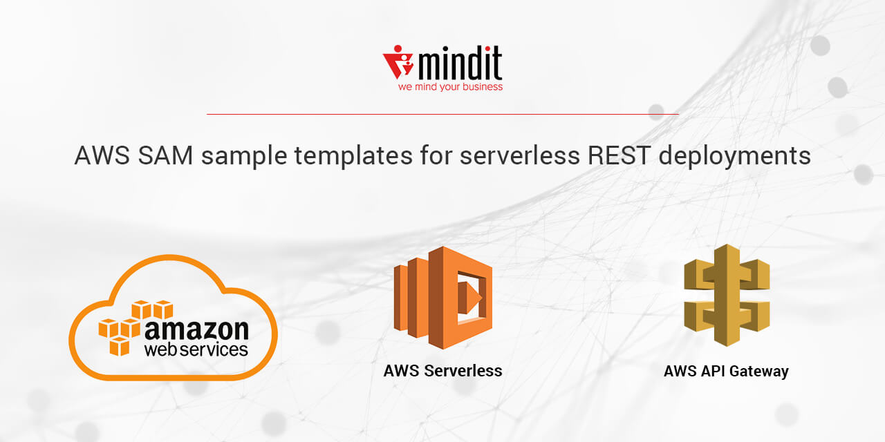
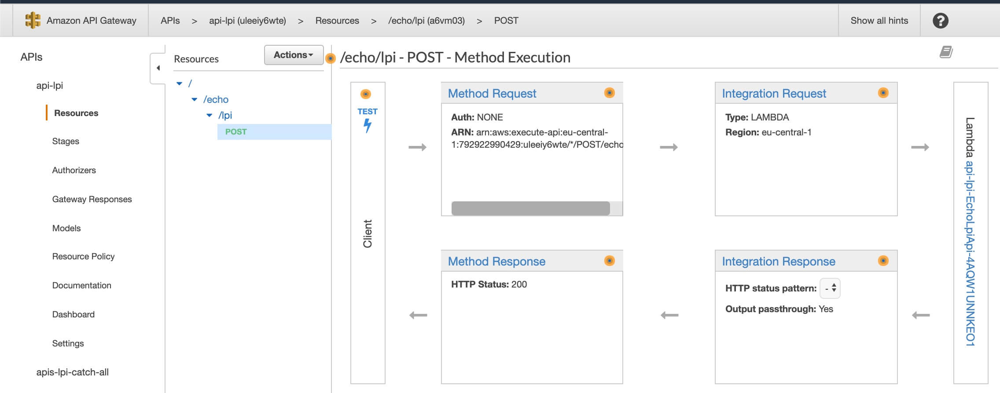
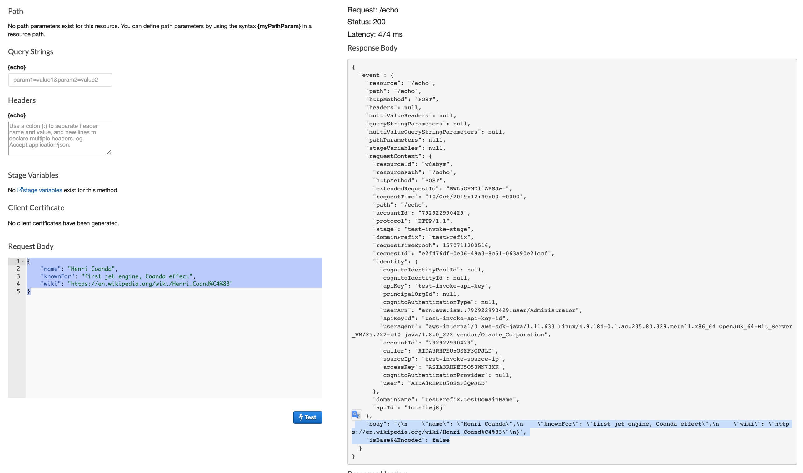
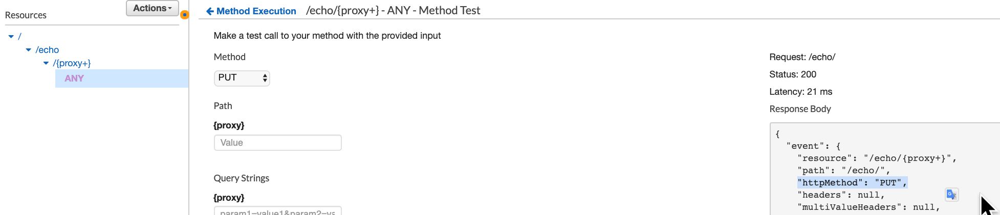
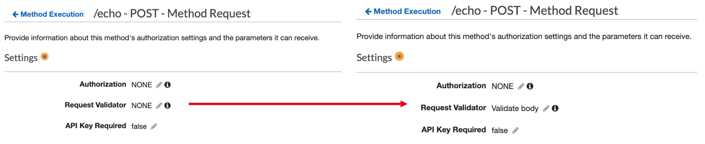

# AWS SAM sample templates for serverless REST deployments


[AWS SAM](https://github.com/awslabs/serverless-application-model) it's a great framework to start building [serverless applications](https://martinfowler.com/articles/serverless.html). With just a few lines of configuration, you can define the application you want and deploy it.

[AWS SAM](https://github.com/awslabs/serverless-application-model) hides all the boilerplate configurations needed if building directly using [AWS CloudFormation](https://aws.amazon.com/cloudformation/) resources and properties. 

While this is great for a quick start, it can become very quickly frustrating when you want to implement slightly more complex functionalities, such as validation, authorization, transformation, etc.

This repository is intended as a storage for various AWS SAM templates, covering different deployments scenarios. 

Currently it holds sample templates for:

| Deployment Scenario | SAM AWS template |
| ------------------- | ---------------- |
| Lambda Proxy Integration | [template-lpi.yaml](template-lpi.yaml)
| Lambda Proxy Integration with HTTP catch all | [template-lpi-catch-all.yaml](template-catch-all.yaml)
| Lambda Proxy Integration with body content validation | [template-lpi-validate.yaml](template-lpi-validate.yaml)
| Lambda Custom Integration | [template-li.yaml](template-lpi.yaml)
| Lambda Custom Integration with body content validation| [template-li-validate.yaml](template-lpi.yaml)

In the future the list of sample templates will be extended with new deployment scenarios (incl transformation, authorization, etc).  

Please refer to the following AWS documentation articles in order to understand the referenced concepts:
* [Lambda Proxy Integration](https://docs.aws.amazon.com/apigateway/latest/developerguide/set-up-lambda-proxy-integrations.html#api-gateway-create-api-as-simple-proxy)
* [Lambda Custom Integration](https://docs.aws.amazon.com/apigateway/latest/developerguide/apigateway-getting-started-with-rest-apis.html)
* [Validation in API Gateway](https://docs.aws.amazon.com/apigateway/latest/developerguide/api-gateway-method-request-validation.html)


## Prerequisites 
In order to run those examples you need to have [SAM CLI](https://docs.aws.amazon.com/serverless-application-model/latest/developerguide/serverless-sam-reference.html#serverless-sam-cli) installed and configured.

Please follow your platform specific [installation instructions](https://docs.aws.amazon.com/serverless-application-model/latest/developerguide/serverless-sam-cli-install.html). 

Following those installations instructions you will end-up with:
* an AWS account 
* AWS / SAM CLI installed and configured locally using the above account 
* an AWS S3 bucket which will be used during the deployment process

## Deployment 

Any of the examples can be deployed using the following commands:
``` bash
sam build -t template.yaml  
sam package --template-file template.yaml --output-template-file packaged.yaml     --s3-bucket your_bucket_name 
sam deploy     --template-file packaged.yaml     --stack-name api-echo     --capabilities CAPABILITY_IAM

```
where:
* **template.yaml** can be replaced with any of the sample templates file names
* **api-echo** can be replaced with any name that you want to be assigned to the deployed API 
* **your_bucket_name** with the bucket name created when you've installed SAM CLI

## API Functionality

All RESTs created by the sample templates are simple echo services. In general, they return the same information that is passeed in the body request. Particular implementation details are mentioned for each scenario. 

APIs are powered by lambda functions. By default the runtime of lambda functions is **nodejs10.x**. 

If you want to run the same examples using Java, just replace in the template the following configuration:   
``` yaml
        FunctionName: echo-lpi
        CodeUri: EchoFunctionJS
        Handler: app.lambdaHandler
        Runtime: nodejs10.x
```
with:
``` yaml
        CodeUri: EchoFunction
        Handler: io.mindit.aws.handler.EchoHandler::handleRequest
        Runtime: java8
        MemorySize: 256
``` 

The simplest way to test the output of of the REST endpoint is by accessing the service in the API Gateway in the AWS console:




## Lambda Proxy Integration 
Template file: [template-lpi.yaml](template-lpi.yaml)

In a Lambda proxy integration, the entire client request is sent to the backend Lambda function as is. API Gateway maps the entire client request to the input event parameter of the backend Lambda function. The Lambda function's output, including status code, headers, and body, is returned to the client as is. For many use cases, this is the preferred integration type. 

With a Lambda proxy integration, API Gateway requires the backend Lambda function to return output according to the following JSON format:
``` json
{
    "statusCode": "...", 
    "headers": {
        "custom-header": "..." 
    },
    "body": "...", 
    "isBase64Encoded": "..."
}
```
where:
* statusCode =  a valid HTTP status code
* custom-header = custom headers that you want to be included in the response 
* body = body of the response as a JSON string
* isBase64Encoded = true/false whether binary support should be included 


Image below shows the behaivour of a serverless endpoint implemented using Lambda Proxy Integration. Entire client request (including headers, body and parameters) is mapped to the event object send to the function. Our lambda function returns the object that it receives in the request:



Template format for this kind of integration is very simple. The entire configuration can be done by using just a single resource: 
 
``` yaml
Resources:
    EchoLpiApi:
      Type: AWS::Serverless::Function 
      Properties:
        FunctionName: echo-lpi
        CodeUri: EchoFunctionJS
        Handler: app.lambdaHandler
        Runtime: nodejs10.x
        Events:
          Request:
            Type: Api
            Properties:
              Path: /echo
              Method: post
```      


## Lambda Proxy Integration with HTTP catch all 
Template file: [template-lpi-catch-all.yaml](template-catch-all.yaml)

This method is applicable when you wish to use an API Gateway as a pure proxy, with little to no intervention on the incoming request. The business logic of the exposed API endpoint is comprised entirely within the Lambda function, which is wholly responsible for handling and responding to the request
When the backend web server opens more resources for public access, the client can use these new resources with the same API setup. But this requiers that the service developer to communicate clearly to the client developer which are the
new accesible resources, and the supported operations.

API Gateway is passing the "httpMethod" action to the lambda function:



The sam AWS template configuration has to mention to the resource path **{proxy+}** and to include the catch-all **ANY** verb for the HTTP method.
``` yaml
Resources:

    EchoLpiApi:
      Type: AWS::Serverless::Function 
      Properties:
        FunctionName: echo-lpi-catch-all
        CodeUri: EchoFunctionJS
        Handler: app.lambdaHandler
        Runtime: nodejs10.x
        Events:
          ProxyApiGreedy:
            Type: Api
            Properties:
              Path: /echo/{proxy+}
              Method: ANY

```

## Lambda Proxy Integration with body content validation 
Template file: [template-lpi-validate.yaml](template-lpi-validate.yaml)

Very often, instead of writing your validation code into the lambda function it is preferable to let the API Gateway manages that for you. You can configure API Gateway to perform basic validation of an API request before proceeding with the integration request. When the validation fails, API Gateway immediately fails the request, returns a 400 error response to the caller.

Figure below shows the results of the validation performed on a incomplete body request:


API Gateway can validate both:
* request parameters 
* request payload 

SAM AWS template offers support to enable validation for lambda proxy integration by using "Request Model" or "Request Parameter" properties of the object describing an event source with type Api. Request model has to be configured in "Models" property of the "AWS::Serverless::API" resource:
``` yaml
EchoWithValidationAPI:
      Type: AWS::Serverless::Api
      Properties:
       ...
        Models: 
          Inventor:
            type: object
            required:
              - name
              - wiki
            properties:
              name:
                type: string
              wiki:
                type: string
              knownFor:
                type: string

              

    EchoWithValidationFunction:
      Type: AWS::Serverless::Function 
      Properties:
       ...
        Events:
          Request:
            Type: Api 
            Properties:
              RestApiId: 
                Ref: EchoWithValidationAPI
              RequestModel:
                Model: Inventor
                Required: true
    
```
<font color="red">Note that, even that this example is similar with the <a href="https://github.com/awslabs/serverless-application-model/tree/master/examples/2016-10-31/api_request_model"> awslabs/serverless-application-model </a>  one, there seems to be an issue with this configuration and you still need to manually activate the validator in the API Gateway console:</font>


## Lambda Custom Integration 
Template file: [template-li.yaml](template-lpi.yaml)

## Lambda Custom Integration with body content validation
Template file: [template-li-validate.yaml](template-lpi.yaml)